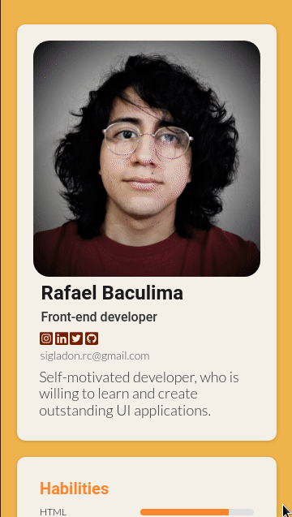

<h1 style="text-align: center">Sigla-Portfolio</h1>

My "Portfolio" solution for a challenge from <a href="http://devchallenges.io" target="_blank">Devchallenges.io</a>. 

  <h3>
    <a href="https://portfolio-sigladon.onrender.com" target="_blank">
      Demo
    </a>
     | 
    <a href="https://devchallenges.io/challenges/5ZnOYsSXM24JWnCsNFlt" target="_blank">
      Challenge
    </a>
  </h3>

## Table of Contents

- [Overview](#overview)
  - [Built With](#built-with)
- [Features](#features)
- [Acknowledgements](#acknowledgements)
- [Contact](#contact)

## Overview

<figure>

<figcaption>Desktop view</figcaption>
</figure>
<figure>

<figcaption>Mobile view</figcaption>
</figure>

I completed the  challenge with HTML, CSS and JavaScript. This is the tenth challenge of DevChallenges I complete. This last challenge was interesting because it is the one that has the most customization. I used grid so that the page could be displayed well on various types of screens. I like the color scheme as it looks, but I'll most likely end up changing it over time. 
### Built With

I used [HTML](https://github.com/sigladon/sigla-portfolio/blob/master/index.html), [CSS](https://github.com/sigladon/sigla-portfolio/tree/master/css) and [JavaScript](https://github.com/sigladon/sigla-portfolio/blob/master/js/tag.js)
## Features

<!-- List the features of your application or follow the template. Don't share the figma file here :) -->

This site was created as a submission to a [DevChallenges](https://devchallenges.io/challenges) challenge. The [challenge](https://devchallenges.io/challenges/5ZnOYsSXM24JWnCsNFlt) was to build an application to complete the given user stories.

- Responsive design

- Mobile First

- Images Optimization

## Acknowledgements

<!-- This section should list any articles or add-ons/plugins that helps you to complete the project. This is optional but it will help you in the future. For exmpale -->
- [W3School - Great website to view documentation](https://www.w3schools.com/) 

- [Steps to replicate a design with only HTML and CSS](https://devchallenges-blogs.web.app/how-to-replicate-design/)

- [Platzi - Great Education Platform](https://platzi.com/)

- [Font Awesome - Icon's library](https://fontawesome.com/)

- [Normalize.css - A modern, HTML5-ready alternative to CSS resets](https://necolas.github.io/normalize.css/)
## Contact
- GitHub [sigladon](https://github.com/sigladon/sigladon)
- Twitter [sigladon](https://twitter.com/sigladon)

